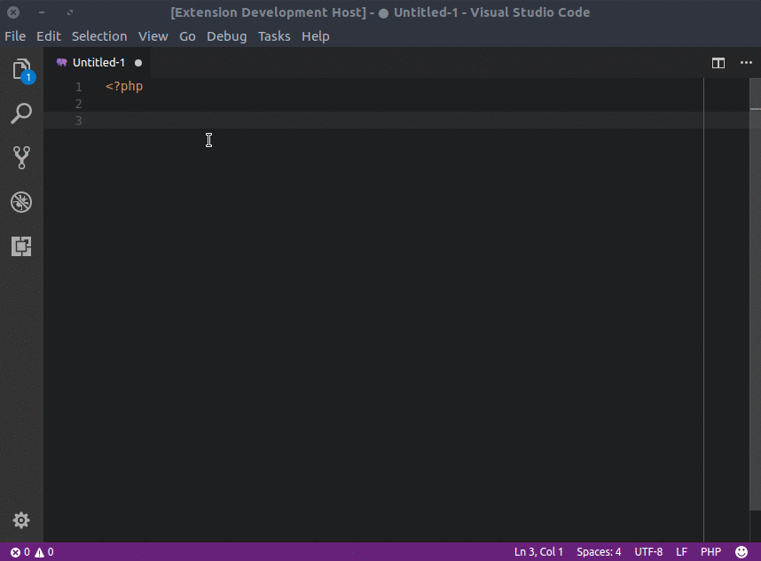

# WooCommerce - Snippets & autocomplete

This extension for Visual Studio Code adds [WooCommerce](https://wordpress.org/woocommerce) snippets and autocomplition of functions, classes and hooks.

## Features

Autocomplete for:

    WooCommerce version: 3.2

    Functions : 522
    Actions   : 496
    Filters   : 496
    Constants : 22

## License

[GPLv3](https://raw.githubusercontent.com/claudiosanches/vscode-woocommerce/master/LICENSE)
